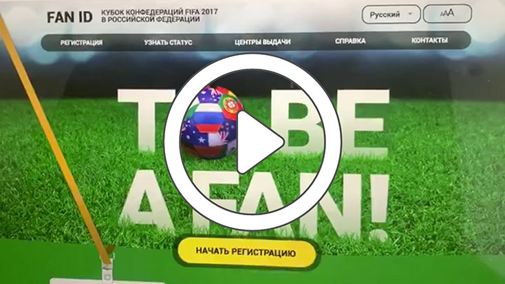

# 2014 - 3D background for soccer champtionship

The task was to make an animated intro for the website.

The initial version, with a prerendered video, did not suit the quality requirements (it can be found [here](https://github.com/demidovsky/threejs/blob/master/www/local/templates/fanid/video/header.mp4))
Therefore, we took a decision to implement 3d right in the browser with WebGL and three.js.

## Curious moments that I remember:

It was difficult to give the ball a natural dynamic. It didn’t want to look like a football in any way, it acted like a bowling ball, then like a billiard ball, then like cast iron)

Separately, I had to bother with adaptive design, because. the ball in one layer (3d), and the letters in another (the rest of the site), but the ball, as planned, should always fly in instead of the letter O.

The diffuse texture and the normal map that I got from the modeler had to be finished by myself, you can see all versions [here](https://github.com/demidovsky/threejs/blob/master/www/3d/diffuse6.jpg) named "diffuseN.jpg") On the diffuse texture, I had to expand the areas, otherwise, the seams would come out at the edges. And the original normal map turned out to be too flat, and the ball looked like it was painted, not stitched.

Finally, all parts was assembled in the right way.

[](https://github.com/demidovsky/threejs/blob/master/demo.mp4?raw=true)


# Run

```
docker-compose up -d
```

Go to http://localhost:8080

